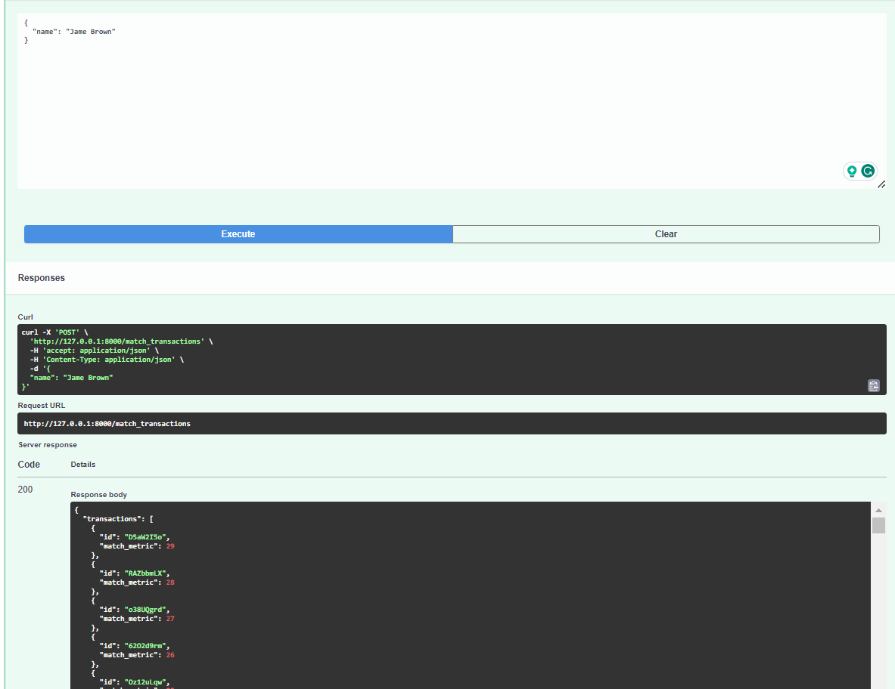

# Deel-interview-assessment


**For tasks 1 and 2, please include a brief discussion of the solution and its possible limitations  in ReadMe.**

**Task 1: Matching Transactions by Name**

Solution:
- The solution uses fuzzy matching (specifically, token sort ratio) to calculate a match metric between the given name and transaction descriptions.
- The transactions are then sorted in descending order of the match metric to determine relevance.
- The API returns the matched transactions and the total number of matches.

Limitations:
- Fuzzy matching may not always accurately capture the intended match. It relies on string similarity, which can be influenced by factors like typos and variations in spelling or formatting.
- The token sort ratio used for matching considers the order of tokens. If the order of words in the name and description doesn't match but the words are present, the match metric may not accurately reflect the intended match.

**Task 2: Finding Transactions with Similar Descriptions**

Solution:
- The solution utilizes language model embeddings to find transactions with semantically similar descriptions.
- It employs a pre-trained language model (BERT) and tokenizer to encode the input text and transaction descriptions into embeddings.
- The cosine similarity between the input embeddings and transaction embeddings is calculated to determine similarity.
- The transactions are sorted in descending order of similarity score to determine relevance.
- The API returns similar transactions, embeddings, and the total number of tokens used to create the embeddings.

Limitations:
- The accuracy of finding similar transactions heavily relies on the quality and relevance of the pre-trained language model used.
- Language model embeddings can be computationally expensive to calculate, especially with large datasets, resulting in slower response times for the API.
- Depending on the complexity of the language model and the number of transactions, memory usage may become a limitation.
- The solution assumes that a pre-trained language model is available and suitable for the task. Fine-tuning or using a domain-specific model might be necessary to achieve better results depending on the specific use case.


## Instructions to Run the Transaction Matching API

### Prerequisites

- Python 3.x installed on your system.

- clone the repo and cd into the repo directory
- Install the required packages by running the following command:
```
pip install -r requirements.txt
```

### Step 2: Prepare the Data

- Prepare the transaction data: Create a CSV file named `transactions.csv` containing the transaction data. The CSV file should have the following columns: `id`, `amount`, and `description`.
  
### Step 3: Start the API

- Open a jupyter notebook terminal.

```
Run the entire code by clicking on the cell/Run all option
```

### Step 4: Test the API

- Once the API server is running, you can test the endpoints using a tool like FastAPI or Postman.

- For Task 1: Matching Transactions by Name, send a POST request to `http://127.0.0.1:8000/docs#/default/match_transactions_match_transactions_post` with the following JSON payload:
```json
{
  "name": "John Doe"
}
```
Replace `"John Doe"` with the desired name you want to match against transaction descriptions.

- For Task 2: Finding Transactions with Similar Descriptions, send a POST request to `http://127.0.0.1:8000/docs#/default/match_transactions_endpoint_find_similar_transactions_post` with the following JSON payload:
```json
{
  "text": "Payment for groceries"
}
```

Replace `"Payment for groceries"` with the desired text you want to find similar transactions for.

- The API will respond with a JSON object containing the matched or similar transactions, along with other relevant information.

### Step 5: Stop the API

- To stop the API server, click on the Kernel/interrupt option on jupyter notebook.

By following these steps, you should be able to run the Transaction Matching API and test the provided endpoints. 

<p align="center"> 
  <kbd>
    <a href="https://github.com/okoliechykwuka/Deel-interview-assessment/blob/main/" target="_blank">
  </a>
  </kbd>
</p>
